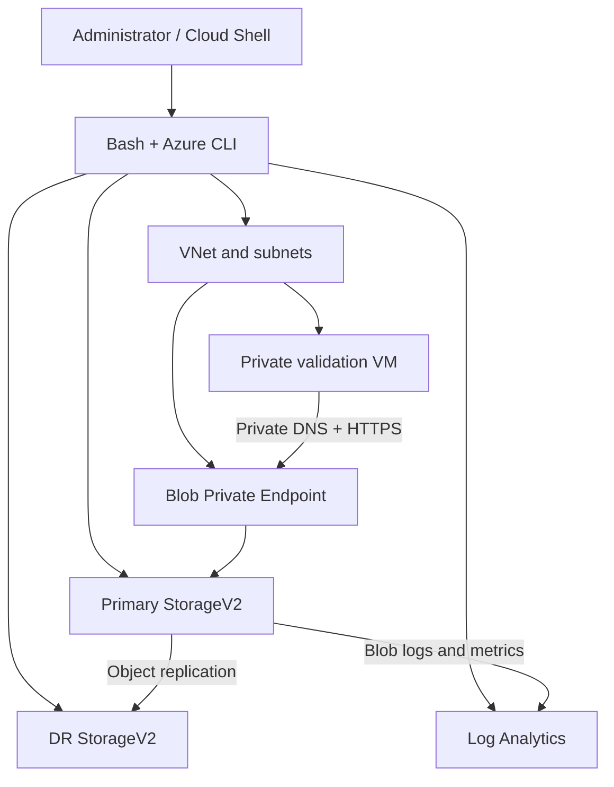

# Azure Secure Storage Capstone

> A secure, automated, and validated Azure Storage platform built as a hands-on capstone for Microsoft AZ-104 exam preparation.

## Project purpose

I built this project to prepare for the **Microsoft Azure Administrator (AZ-104)** exam and to turn the Storage domain objectives into a realistic implementation. Instead of configuring every resource manually, I used **Bash** and **Azure CLI** to deploy and validate the environment as a repeatable workflow.

The project demonstrates secure access, data protection, encryption, lifecycle optimization, private connectivity, monitoring, and asynchronous object replication across two storage accounts.

## Architecture



## Implemented capabilities

| Area | Implementation |
|---|---|
| Secure transport | HTTPS-only traffic and minimum TLS 1.2 |
| Anonymous access | Blob public access disabled |
| Network isolation | Storage firewall default action `Deny` |
| Private connectivity | Blob Private Endpoint and Private DNS integration |
| Controlled VNet access | Microsoft.Storage Service Endpoint on the client subnet |
| Identity | System-assigned Managed Identity on Storage and the validation VM |
| Delegated access | Policy-bound Service SAS using a Stored Access Policy |
| Encryption | Microsoft-managed encryption plus a dedicated `finance-scope` |
| Scope enforcement | Finance container prevents encryption-scope override |
| Data protection | Blob and container soft delete, versioning, change feed, and PITR |
| Cost optimization | Lifecycle rule for blobs under the `logs/` prefix |
| File services | Azure Files operations share and snapshot workflow |
| Disaster recovery | Asynchronous Object Replication to a second storage account |
| Monitoring | Blob diagnostic logs and transaction metrics sent to Log Analytics |
| Automation | Idempotent-style Bash deployment and read-only validation scripts |

## Repository structure

```text
Azure-Secure-Storage-Capstone/
├── README.md
├── deploy.sh
├── validate.sh
├── RUNBOOK.md
├── screenshot-checklist.md
├── .gitignore
├── LICENSE
└── docs/
    ├── architecture.md
    ├── az-104-mapping.md
    ├── sandbox-limitations.md
    ├── validation-summary.md
    └── screenshots/
        └── README.md
```

## Deployment

The project is designed for Azure Cloud Shell using Bash.

```bash
chmod +x deploy.sh validate.sh
bash deploy.sh | tee deployment-output.txt
```

If more than one resource group is visible, select the target explicitly:

```bash
export AZURE_RG='your-resource-group-name'
bash deploy.sh | tee deployment-output.txt
```

After deployment:

```bash
bash validate.sh | tee validation-output.txt
```

See [RUNBOOK.md](RUNBOOK.md) for the time-boxed execution procedure.

## Verified lab results

The deployment completed in **391 seconds** inside a restricted 45-minute sandbox. The following results were directly validated:

| Validation | Observed result |
|---|---|
| HTTPS-only | Enabled |
| Minimum TLS | TLS 1.2 |
| Anonymous Blob access | Disabled |
| Storage firewall | Default action `Deny` |
| Storage identity | System-assigned |
| Versioning and Change Feed | Enabled |
| Blob and container soft delete | Enabled |
| Point-in-time restore | Enabled |
| Encryption scope | `finance-scope` enabled |
| Lifecycle management | `logs-cost-optimization` enabled |
| Private Endpoint | Approved for the Blob subresource |
| Private DNS | Public Blob hostname resolved to private IP `10.40.2.4` |
| Private HTTPS path | Azure Storage responded over the private endpoint |
| Diagnostic setting | `diag-blob-to-law` connected to Log Analytics |
| Object Replication | One matching policy on source and destination (`1/1`) |

The detailed evidence record is available in [docs/validation-summary.md](docs/validation-summary.md).

## Security design decisions

- Data-plane resources are created before the Storage firewall is changed to `Deny`.
- The validation VM has no public IP and tests the Storage endpoint from inside the VNet.
- Private DNS maps the normal Blob hostname to the Private Endpoint address.
- The finance container enforces a dedicated encryption scope and prevents override.
- The Service SAS is linked to a Stored Access Policy so access can be centrally revoked.
- Secrets, account keys, connection strings, and SAS signatures are never printed by the scripts.
- Generated environment and validation files are excluded from source control.

## Sandbox constraints

The training sandbox restricted region selection and RBAC operations. Therefore:

- The DR storage account fell back to the primary region. Object Replication was still successfully demonstrated, but production deployment should use a supported secondary region.
- Full Customer-Managed Key integration with Key Vault was documented as a production extension because the sandbox did not permit the required role assignment.
- The Azure Files snapshot and Stored Access Policy screenshots were not captured before the sandbox expired. The Stored Access Policy was a required successful deployment step; the snapshot workflow remains an optional validation item.

See [docs/sandbox-limitations.md](docs/sandbox-limitations.md) for the complete explanation.

## Key learning

The strongest lesson from this capstone was the value of automation. A Bash script made it possible to build a multi-service Azure environment in minutes, apply consistent security settings, handle sandbox fallbacks, and run repeatable validation. This is why cloud professionals rely on scripting and Infrastructure as Code instead of depending only on manual Portal configuration.

After completing AZ-104, I plan to deepen my skills in Bash, Azure CLI, PowerShell, and Infrastructure as Code.

## AZ-104 skills demonstrated

- Configure Azure Storage accounts and redundancy
- Secure Storage with firewalls, Service Endpoints, and Private Endpoints
- Configure Blob lifecycle management and access tiers
- Configure SAS and Stored Access Policies
- Configure encryption scopes and data protection
- Configure Azure Files and share snapshots
- Configure Object Replication
- Configure diagnostic settings and Log Analytics integration
- Use Managed Identities and Azure CLI for administration

See [docs/az-104-mapping.md](docs/az-104-mapping.md) for the objective-to-implementation mapping.

## Production improvements

- Deploy the DR account in a separate Azure region.
- Use Key Vault-backed Customer-Managed Keys with automatic key rotation.
- Assign least-privilege data-plane roles to Managed Identities.
- Replace sandbox-generated SSH settings with an approved enterprise access pattern.
- Convert the Bash deployment into Bicep or Terraform and add CI/CD validation.
- Add Azure Monitor alerts and retention policies for operational monitoring.

## Author

**Sohrab Jalali**  
IT Support & Network Engineer transitioning toward Cloud Engineering

This project was created as practical preparation for the **Microsoft AZ-104: Azure Administrator** certification.
