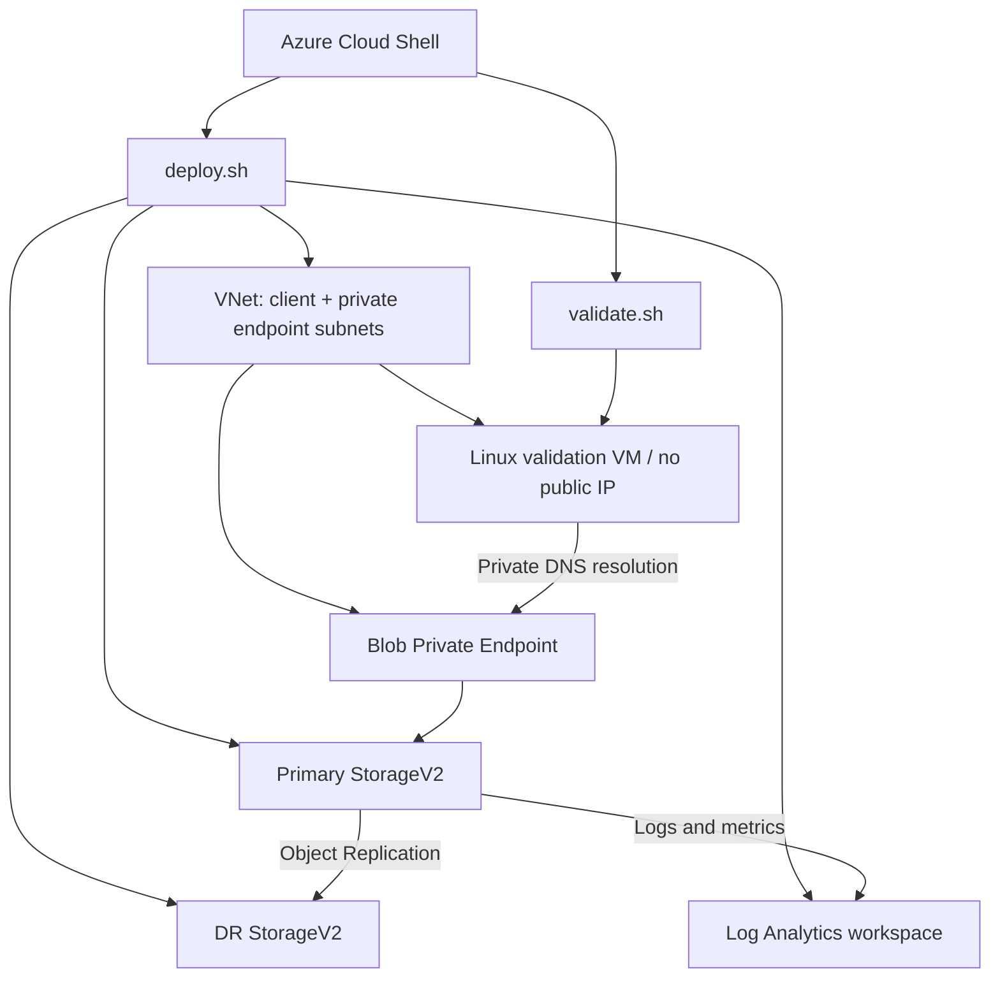
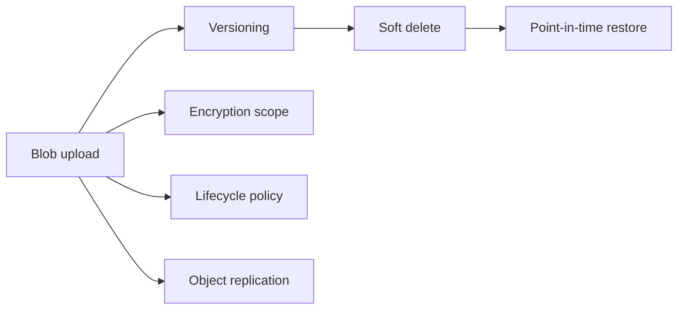

# Architecture and Request Flow

## Logical architecture

## Private access flow

1. The VM requests the normal endpoint: `<storage>.blob.core.windows.net`.
2. Azure Private DNS returns the Private Endpoint address rather than the public Storage address.
3. Traffic remains on the VNet and reaches the Blob subresource through Private Link.
4. The Storage firewall remains at default action `Deny`.
5. Anonymous data access is still rejected even though network connectivity succeeds.

## Data-protection flow

## Security boundaries

| Boundary | Control |
|---|---|
| Transport | HTTPS-only and TLS 1.2 minimum |
| Public data exposure | Anonymous Blob access disabled |
| Network | Firewall default `Deny`, selected subnet, Private Endpoint |
| Name resolution | Private DNS zone linked to the VNet |
| Identity | System-assigned Managed Identities |
| Delegation | Service SAS bound to a Stored Access Policy |
| Encryption | Platform encryption plus enforced finance encryption scope |
| Recovery | Versioning, soft delete, change feed, PITR, and replication |
| Monitoring | Storage diagnostics sent to Log Analytics |
